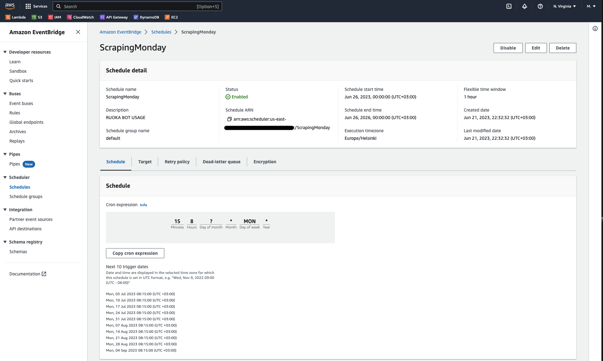

# Ruoka Bot 

## Description
Below is an example of an application (telegram bot) running on the [AWS](https://aws.amazon.com/) architecture. The functionality of this application is to collect information (menu) from local restaurants ([Kehruuhuone](https://www.raflaamo.fi/fi/ravintola/lappeenranta/kehruuhuone), [Wolkoff](https://wolkoff.fi/), [The Kitchen](https://ravintolakitchen.fi/)) in the city of Lappeenranta 🇫🇮 once a week on Mondays, translate them in three languages, save it to a dedicated storage and, at the request of the user in the Telegram application, send a response with the current menu.

To access the bot functionality please visit:


## App architecture


## Configuration

**0. Create Lambda Function in AWS**


more info: 
- [AWS. Lambda getting started](https://docs.aws.amazon.com/lambda/latest/dg/getting-started.html)

**1. Copy the repository to your local machine:**

```bash
git clone https://github.com/makarovm-m/Ruoka.git
```

Here is a simple structure of the repository:
```
Ruoka
├─ LottaBot
│  ├─ .env
│  ├─ bot.py
│  └─ requirements.txt
├─ README.md
├─ ScrapingFood
│  ├─ lambda_function.py
│  └─ layer_1
│     └─ requirements.txt
│     ├─ .env
│     ├─ scrapper_kehru_toCSV.py
│     ├─ scrapper_kitchen_toCSV.py
│     └─ scrapper_wolkoff_toCSV.py
├─ RuokaPerm.pem
└─ pics
```

- `LottaBot` folder which contains the script `bot.py` which should be launched at the AWS instance, `requirements.txt` and `.env` (don't forget to put) file which should contain token to your Telegram bot. It can be packed in a zip file and uploaded afterwards to the inctance. 
- `ScrappingFood` folder contains AWS Lambda function `lambda_function.py` (will be used in AWS), environment variables, scraping scripts and it's dependencies.
- `RuokaPerm.pem` permission certificate to your AWS instance.

**2. Optional. Create and activate virtual environment if you want to run and update the code.**

```bash
python3 -m venv venv
source venv/bin/activate
```

**3. run the following commands:**

```bash
# preparing layer for lambda function
cd layer_1                                  
mkdir python                                 
pip uninstall numpy                          
pip install -r requirements.txt -t ./python 
```
make sure that you don't have numpy 1.2.5. in your lambda layer, if exists then delete folders related to numpy. It can cause an error with Python v 3.9.

**4. run the following commands:**

```bash
# move files from layer_1 to python dir
mv scrapper_kehru_toCSV.py python/
mv scrapper_kitchen_toCSV.py python/
mv scrapper_wolkoff_toCSV.py python/
mv .env python
# create zip
zip -r ../layer_1.zip .
```
when zip package is prepared it can be uploaded to Layers in AWS Lambda.

**5. Create layer in AWS and upload using ZIP file:**


here some useful links about python packages in AWS:
- [AWS. Python package](https://docs.aws.amazon.com/lambda/latest/dg/python-package.html)

**6. Attach layers to your Lambda function:**
- layer that you have added
- layer that exists in AWS (AWSSDKPandas-Python39-Arm64) where Python and Numpy compatibility is configured


here are some useful links about layers in AWS:
- [AWS. Configuration layers](https://docs.aws.amazon.com/lambda/latest/dg/configuration-layers.html#configuration-layers-path)
- [YouTube. How to use Layers in AWS lambda](https://www.youtube.com/watch?v=uiRATBv8IQA&t=280s)
- [Medium. Getting started with aws lambdalayers](https://medium.com/the-cloud-architect/getting-started-with-aws-lambda-layers-for-python-6e10b1f9a5d)

**7. Create S3 bucket and give all nececcary permisions to Lambda for reading and writing in AWS S3 service**

- [Towardsdatascience. Additing policies in AWS](https://towardsdatascience.com/how-to-upload-and-download-files-from-aws-s3-using-python-2022-4c9b787b15f2)
- [AWS. Adding policies to AWS lambda](https://repost.aws/knowledge-center/lambda-execution-role-s3-bucket)


**8. The resulting view**

when all done the resulting view should be like at the pic below:


**9. Amazon EventBridge setup**

Lastly we should trigger our AWS Lambda function by schedule. For this purpose we will be using [Amazon EventBridge](https://us-east-1.console.aws.amazon.com/scheduler/home?region=us-east-1#schedules).

Here is a configuration for Modays at 8.15 AM:



**10. Create a bot using BotFather**

Short description provided here: 
- [Medium. create a telegram bot](https://medium.com/shibinco/create-a-telegram-bot-using-botfather-and-get-the-api-token-900ba00e0f39)

**11. Create AWS instance and grant access to S3**

- [Towardsdatascience. Run your python scripts in amazon ec2](https://towardsdatascience.com/how-to-run-your-python-scripts-in-amazon-ec2-instances-demo-8e56e76a6d24)
- [AWS. EC2 instance access s3 bucket](https://repost.aws/knowledge-center/ec2-instance-access-s3-bucket)

**12. ZIP your bot folder and upload to EC2 instance**

```bash
# in local terminal
zip -r LottaBot.zip Ruoka/LottaBot
scp -i /Users/max/Documents/GitHub/Ruoka/RuokaPerm.pem /Users/max/Documents/GitHub/Ruoka/LottaBot.zip ec2-user@54.88.51.244:~
```

```bash
# in EC terminal
cd home/ec2-user/
unzip LottaBot.zip
cd LottaBot
sudo yum update
sudo yum install python3-pip
pip3 --version
pip install -r requirements.txt
python3 bot.py

```


